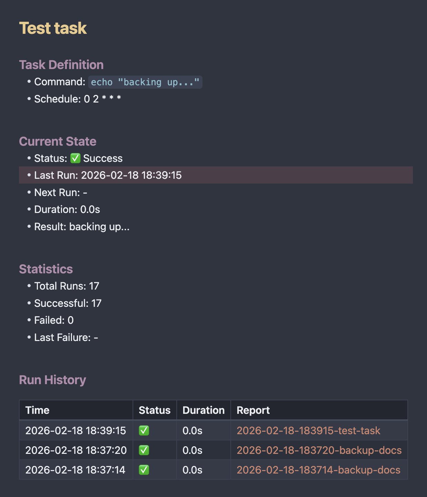

# Obsidian Task Automation

Python CLI tool that reads task definitions from Obsidian Markdown files, executes them, and writes results back to Markdown. All task state lives in the vault — no databases, no external state files.



## Features

- **All state in Markdown** — task definitions, execution results, statistics and run history live in your vault
- **Run History** — each task file includes a table of recent executions with status, duration and links to detailed reports
- **Obsidian integration** — report links use `[[wiki-links]]` so you can click through from the history table directly to full execution reports
- **Shell Commands plugin support** — trigger tasks from Obsidian's UI with a single click
- **Task parameters** — pass dynamic data to commands via `#### Parameters` section, with full audit trail in reports
- **No external dependencies** — no databases, no cloud services, just Markdown files

## Status: MVP

This project is in **MVP stage** — manual execution works, automatic scheduling does not exist yet.

**What works now:**
- Define tasks in Markdown, run them manually via CLI or Obsidian Shell Commands plugin
- Execution results, statistics and run history are written back to the task file
- Detailed reports with full output are created in `Reports/`
- The `Schedule` field is parsed but **not acted on** — there is no background scheduler or cron daemon

**Planned (post-MVP):**
- Background scheduler that runs tasks automatically based on their cron schedule
- Catch-up logic for missed executions after downtime

## Installation

Requires Python 3.13+.

```bash
git clone https://github.com/afkal/obsidian-task-automation.git
cd obsidian-task-automation
python -m venv .venv
.venv/bin/pip install -e ".[dev]"
```

## Quick Start

```bash
# 1. Point obs-tasks at your Obsidian vault
obs-tasks init /path/to/your/vault

# 2. Create a task file in Tasks/
#    e.g. Tasks/Backup Docs.md (see format below)

# 3. List tasks
obs-tasks list
obs-tasks list -v    # verbose

# 4. Run a task
obs-tasks run "Backup Docs"
obs-tasks run --file "/path/to/Tasks/Backup Docs.md"
```

## Task File Format

Each `.md` file in `Tasks/` is one task. The filename (without `.md`) is the task title.

```markdown
#### Task Definition
- Command: `rsync -av ~/Documents /backup/docs`
- Schedule: 0 2 * * *

#### Current State
- Status: ✅ Success
- Last Run: 2024-12-16 02:00:15
- Next Run: -
- Duration: 45.2s
- Result: Sent 3 files

#### Statistics
- Total Runs: 47
- Successful: 46
- Failed: 1
- Last Failure: 2024-11-15 02:00:00

#### Run History
| Time | Status | Duration | Report |
|------|--------|----------|--------|
| 2024-12-16 02:00:15 | ✅ | 45.2s | [[2024-12-16-020015-backup-docs]] |
| 2024-12-15 02:00:12 | ✅ | 44.8s | [[2024-12-15-020012-backup-docs]] |
| 2024-12-14 02:00:09 | ❌ | 1.2s | [[2024-12-14-020009-backup-docs]] |
```

**You write:** `#### Task Definition` with `- Command:` and `- Schedule:` lines.

**The tool writes:** `#### Current State`, `#### Statistics` and `#### Run History` sections after each run. The history table shows the 20 most recent executions with clickable `[[wiki-links]]` to detailed report files.

You can add any other headings or notes (e.g. `#### Notes`) — they won't be touched.

### Parameters

Tasks can include an `#### Parameters` section with key-value pairs. Parameters are automatically appended to the command as a JSON string:

```markdown
#### Task Definition
- Command: `python invoice.py`
- Schedule: 0 9 1 * *

#### Parameters
- Amount: 1234.56
- Customer: Acme Corp
- Invoice Number: INV-2026-02
```

When run, the command becomes:
```
python invoice.py '{"amount": "1234.56", "customer": "Acme Corp", "invoice_number": "INV-2026-02"}'
```

If you need the JSON in a specific position, use the `{{params}}` placeholder:
```
- Command: `python invoice.py {{params}} --verbose`
```

Parameter keys are normalised (lowercase, spaces → underscores).

Each execution report includes a **Parameters** table, creating an audit trail even when the vault is not version-controlled.

## CLI Commands

| Command | Description |
|---------|-------------|
| `obs-tasks init <vault_path>` | Initialise config, create Tasks/ and Reports/ |
| `obs-tasks list [-v]` | Show all tasks and their status |
| `obs-tasks run <name>` | Run a task by name (partial match, case-insensitive) |
| `obs-tasks run --file <path>` | Run the task in a specific file |
| `obs-tasks --version` | Show version |

## Running Tasks from Obsidian

You need two community plugins: **Shell Commands** (to run the CLI) and optionally **Commander** (for a visual ▶ button).

### 1. Shell Commands plugin

1. Install [Shell Commands](https://github.com/Taitava/obsidian-shellcommands) from Community Plugins
2. Settings → Shell Commands → **New command**, paste:
   ```
   /full/path/to/.venv/bin/obs-tasks run --file {{file_path:absolute}}
   ```
   > **Important:** Do NOT wrap `{{file_path:absolute}}` in quotes — the plugin handles spaces in paths automatically. Quotes cause escaping issues.
3. Give it an alias like `Run Task`
4. Assign a hotkey (e.g. `Ctrl+Shift+R` / `Cmd+Shift+R`)

Now open any task file and press the hotkey to execute it.

### 2. Commander plugin (optional — adds a ▶ button)

1. Install [Commander](https://github.com/phibr0/obsidian-commander) from Community Plugins
2. Settings → Commander → **Ribbon** → Add command
3. Search for your Shell Commands alias (`Run Task`)
4. Pick an icon (e.g. `play`)

You'll now see a ▶ button in the Obsidian ribbon — click it while viewing a task file to run it.

## Reports

Each execution creates a report in `Reports/` with:

- Timestamp, duration, command, exit code
- Parameters used (if any) — provides an audit trail of what data was passed
- Full stdout and stderr output
- Obsidian backlink to the task file (`[[Task Name]]`)

Report filenames: `YYYY-MM-DD-HHMMSS-task-slug.md`

Reports are automatically linked in the task file's **Run History** table — click any `[[report]]` link in Obsidian to jump to the full execution details.

## Development

```bash
# Run tests
.venv/bin/pytest tests/
.venv/bin/pytest tests/ -v                 # verbose
.venv/bin/pytest tests/ --cov=obs_tasks    # with coverage

# Install in development mode
.venv/bin/pip install -e ".[dev]"
```

## License

MIT
